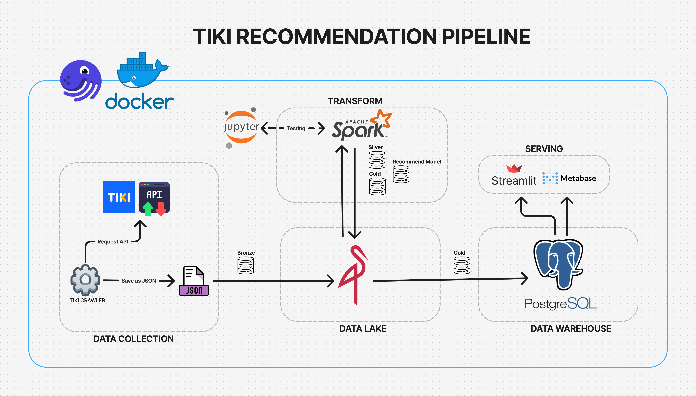
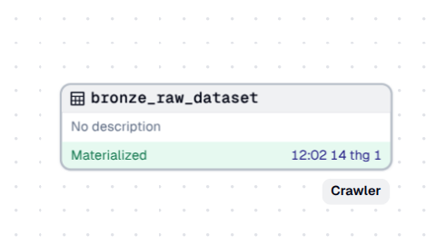
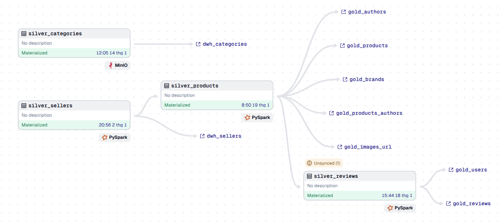
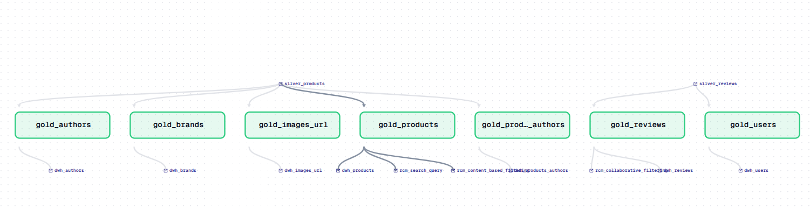
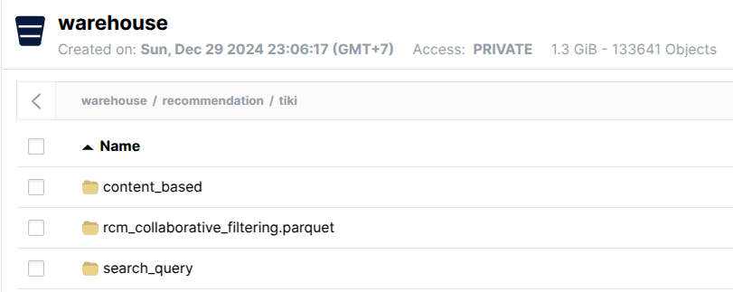
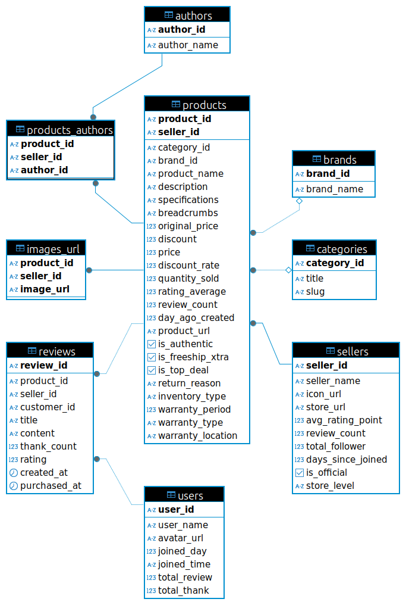
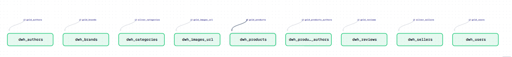

# TIKI Recommender ETL Pipeline

## 1. Abstract
This project is an **ETL pipeline** designed to extract raw data from [Tiki](https://tiki.vn/) (a Vietnamese e-commerce platform), transform and clean it, and store it in a **data warehouse** for analytics and recommendation system development.

This project applies knowledge from the **"Fundamental Data Engineering"** course by [AIDE](https://aisia.vn/courses). Special thanks to **Mr. Nguyen Thanh Binh** and **Mr. Hung Le** for their guidance.

## 2. Data Pipeline Diagram



### List of Technologies Used
- **[Dagster](https://dagster.io/)** - Data orchestration & monitoring.
- **[Docker](https://www.docker.com/)** - Containerization platform.
- **[MinIO](https://min.io/)** - Object storage for data lake.
- **[Apache Spark](https://spark.apache.org/)** - Distributed data processing.
- **[PostgreSQL](https://www.postgresql.org/)** - Data warehouse storage.
- **[Metabase](https://www.metabase.com/)** - Business Intelligence (BI) dashboard.
- **[Streamlit](https://streamlit.io/)** - Interactive web application for recommendations.

## 2.1 Data Collection (Extract)

We use a Python class [`TikiCrawler`](https://github.com/nchn471/tiki-recommender-etl-pipeline/blob/main/etl_pipeline/etl_pipeline/resources/tiki_crawler.py) to fetch data from Tiki's API and store it as JSON files in MinIO.

### Raw Data Storage Structure
```
warehouse/bronze/tiki/{category_name}/{product_id}_{seller_id}
```
- `product_{product_id}_{seller_id}.json` → Product details.
- `seller_{product_id}_{seller_id}.json` → Seller details.
- `reviews/reviews_{product_id}_{seller_id}_{page}.json` → Customer reviews (first 10 pages).
- `categories.csv` → List of product categories.

### Bronze Layer Asset Structure


## 2.2 Transform
### 2.2.1 Silver Layer
- The bronze layer is cleaned and converted into structured **Spark DataFrames**: `categories`, `products`, `sellers`, `reviews`.
- Data is stored as **Parquet files** in MinIO.

**Example: Transforming `reviews` data**
```python
@asset(
    ins={"silver_products": AssetIn(key_prefix=["silver", "tiki"])}
    io_manager_key="spark_io_manager",
    key_prefix=["silver", "tiki"],
    group_name="silver_layer",
    compute_kind="PySpark"
)
def silver_reviews(silver_products):
    transformer = TikiTransform(MINIO_CONFIG)
    reviews_df = transformer.transform_data(type="reviews")
    
    with connect_spark(SPARK_CONFIG) as spark:
        reviews_spark_df = spark.createDataFrame(reviews_df)
        reviews_spark_df = reviews_spark_df.join(
            silver_products.select("product_id", "seller_id"),
            on=["product_id", "seller_id"], how="inner"
        )
        reviews_spark_df = reviews_spark_df.dropDuplicates(["review_id"])
    
    return Output(
        reviews_spark_df,
        metadata={"table": "silver_reviews", "records count": reviews_spark_df.count()},
    )
```


### 2.2.2 Gold Layer
- Data is optimized for **storage & querying**.
- Attributes such as `brand`, `author`, etc., are extracted into separate tables.



### 2.2.3 Recommendation Layer


#### **Content-Based Filtering**
- Analyzes product **title & description**, removes stopwords, and tokenizes text.
- Uses **TF-IDF** and **Gensim Similarity** to compute similarity scores.
- **Formula for TF-IDF**:
  
  $$TF(t, d) = \frac{f_{t,d}}{ \sum_{t' \in d} f_{t',d} }$$
  
  $$IDF(t) = \log \left(\frac{N}{1 + DF(t)} \right)$$
  
  $$TF-IDF(t, d) = TF(t, d) \times IDF(t)$$

#### **Collaborative Filtering (ALS Model)**
- Uses **Alternating Least Squares (ALS)** in Apache Spark to generate recommendations.

```python
from pyspark.ml.recommendation import ALS

als = ALS(userCol="customer_id", itemCol="item_index", ratingCol="rating", coldStartStrategy="drop")
model = als.fit(gold_reviews)
```

### **Recommendation Model Storage**


## 2.3 Data Warehouse (Load)
- Processed data is loaded into **PostgreSQL** for analytics.




## 3. Serving
- **Metabase Dashboard** for data visualization.
- **Streamlit-based Recommendation System** for real-time product suggestions.

💡 **Explore these features in the sidebar!** 🚀

